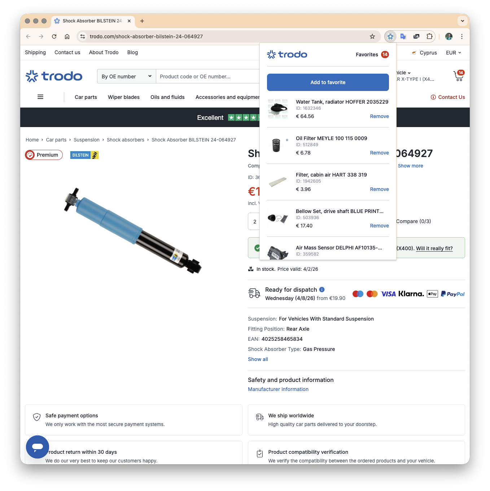

# Cart Keeper

A Chrome extension that lets you save products from integrated stores into one local list.

[](./public/screenshots/main.png)

## Features

- Save products directly from integrated product pages
- Currently integrated store: Trodo.com
- View saved products in a clean popup UI
- Groups saved products by marketplace
- Displays product image, price, and discount
- Stores data locally in the browser (no backend)
- Prevents duplicate entries

---

## Installation (Development)

### 1. Clone the repository

```bash
git clone https://github.com/your-username/shopping-cart-extension.git
cd shopping-cart-extension
```

### 2. Install dependencies

```bash
npm install
```

### 3. Build the extension

```bash
npm run build
```

### 4. Load the extension in Chrome

1. Open Chrome and navigate to `chrome://extensions`
2. Enable "Developer mode"
3. Click "Load unpacked"
4. Select the `dist` folder from the project directory

### 5. Usage

1. Open any product page on an integrated store
2. Click the extension icon
3. Save the product
4. Open the extension popup to manage saved products

### 6. Tech Stack

1. React
2. TypeScript
3. Vite
4. Tailwind CSS
5. Chrome Extension Manifest V3

### 7. Marketplace integrations

Marketplace support is split into two layers:

1. Add shared marketplace metadata in `src/marketplaces.ts`.
2. Add a content adapter in `src/content/adapters`.
3. Register the adapter in `src/content/adapters/index.ts`.
4. Add the marketplace host to `public/manifest.json` under `host_permissions` and `content_scripts.matches`.

Adapters are responsible for detecting product pages and returning a normalized `SavedProduct`.

### 8. Privacy

This extension does not collect or transmit any user data.
All data is stored locally in the browser.

See [Privacy Policy](./privacy-policy.md) for more details.
